# AskHR: Automatize tarefas de RH com a IA da Agentic

## Índice

- [AskHR: Automatize tarefas de RH com a IA da Agentic](#askhr-automatize-tarefas-de-rh-com-a-ia-da-agentic)
  - [Índice](#índice)
  - [Pré requisitos](#pré-requisitos)
  - [Começando com o watsonx Orchestrate](#começando-com-o-watsonx-orchestrate)
    - [Agente FAQ - RH](#agente-faq---rh)

## Pré requisitos

- Verifique com seu instrutor se **todos os sistemas** estão funcionando antes de continuar.
- Confirme se você tem acesso ao ambiente Techzone correto para este laboratório.
- O diretório [Assets](./Assets) contém todos os assets e documentos que vamos utilizar como fonte de conhecimento externa.

## Começando com o watsonx Orchestrate

1. Faça login na <b>IBM Cloud</b> (cloud.ibm.com)

2. Navegue até o menu hambúrguer no canto superior esquerdo, clique em `Resource List`

3. Abra a seção de `IA/Machine Learning.` Você deve ver um serviço `watsonx Orchestrate`, clique nele para abrir


4. Abra a seção de `IA/Machine Learning.` Você deve ver um serviço `watsonx Orchestrate`, clique nele para abrir

5. Ao iniciar o <b>Watsonx Orchestrate</b>, você será direcionado para esta página.

Clique no botão azul `Launch watsonx Orchestrate`


### Agente FAQ - RH

1.  Clique no menu de hambúrguer no canto superior esquerdo

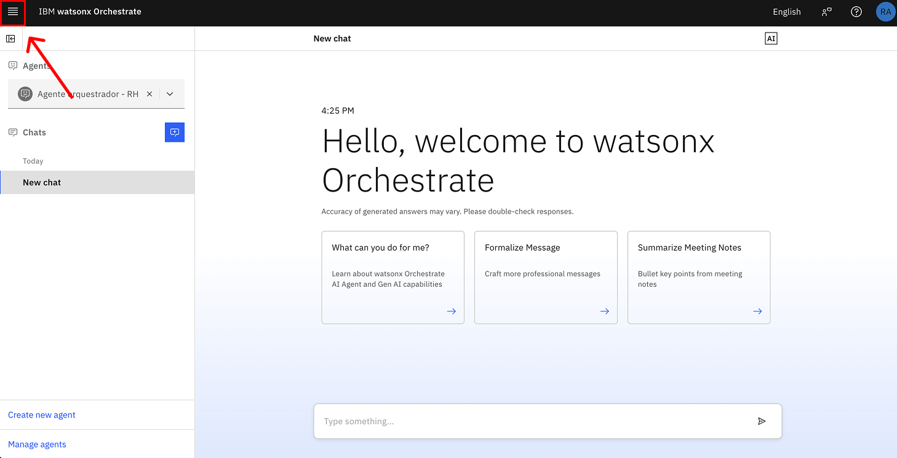

2. Clique em **Build**:

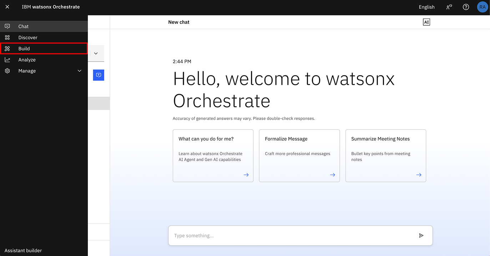

3. Clique em **Create agent +**:

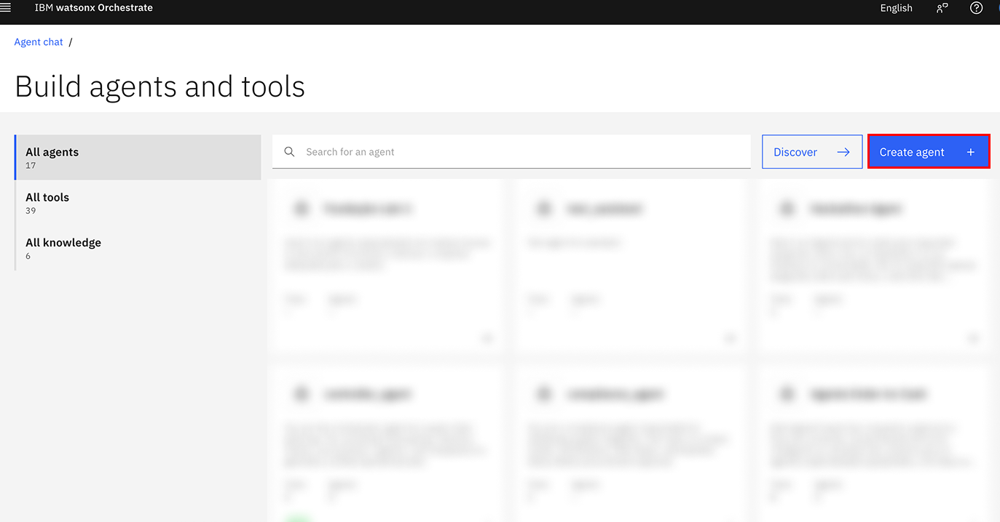

4. Selecione `Create from scratch`

E então, escolha um nome para seu agente e uma boa descrição.

<b>Siga os exemplos a seguir, copiando e colando no campo correspondente /b>

Nome: **Agente de FAQ - RH**

Descrição: **Agente responsável por lidar com as dúvidas dos funcionários sobre RH. Você fornece respostas curtas e concisas, com no máximo 500 palavras.**
  
5. Clique em **Create**:

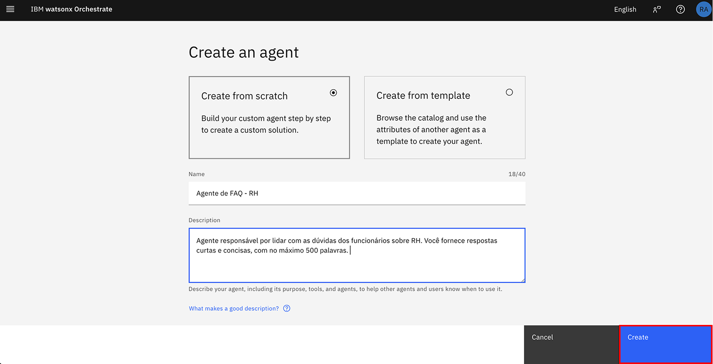

6. Ao lado do nome de seu agente, clique em `Model` selecione o `llama` do tipo `vision`

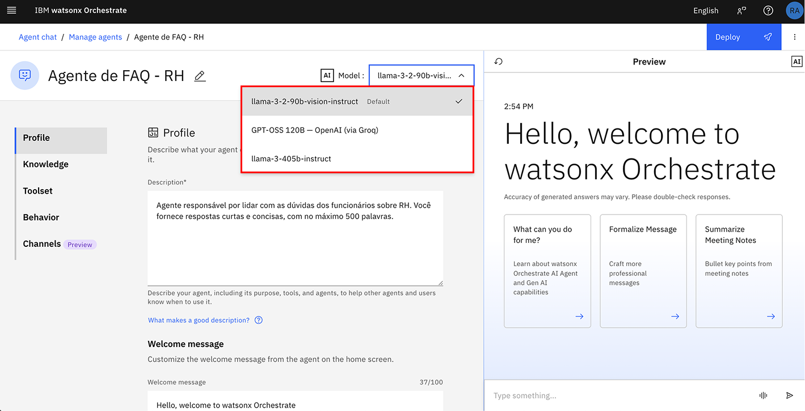

7. E então, selecione `ReAct` na seção Agent style.

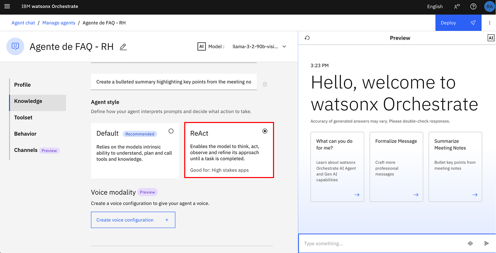

8. Logo abaixo, temos uma sessão chamada **Welcome message**, onde você também pode configurar uma mensagem de boas vindas que será exibida na interface para o usuário, como mostrado na imagem abaixo.

Essa mensagem é opcional. Você pode escrever algo como: `Olá sou o Agente de RH da Empresa X`


9. Em seguida, **Quick start prompts** onde podemos definir mensagens de atalho. Essas mensagens serão exibidas para o usuário como botões na interface, funcionando como atalhos para ações.

Por exemplo:

`marcação de férias`

`consultar saldo de férias`

`atualização de endereço`

Você pode criar esses botões clicando em `Add prompt +` e removê-los clicando no ícone de lixeira.

Esse passo também é opcional. Para que essas opções apareçam na telinha de `preview` do lado direito da tela, use o ícone de restart para atualizar a interface. <b> Não é necessário sair da página. </b>


10. Navegue página abaixo até a seção **Knowledge**. Clique em **Add source**.

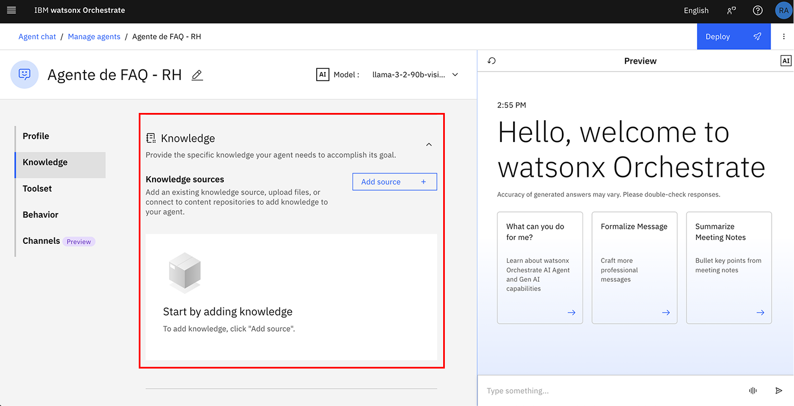

11. Clique em  **New knowlegde**

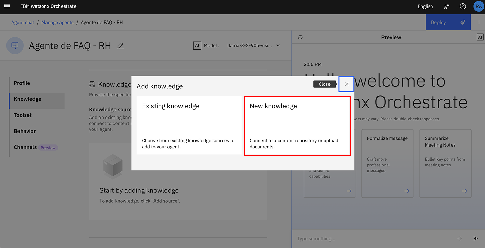

12. Clique em **Upload File** e depois em **Next**

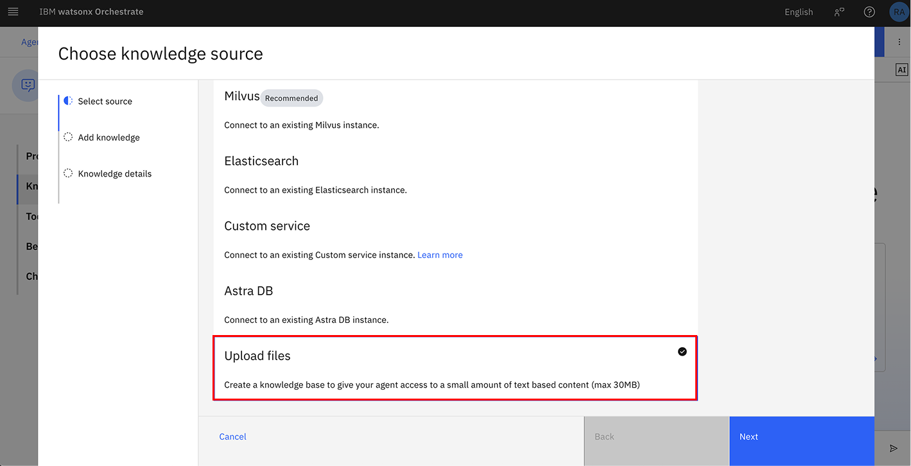

13. Clique e arraste o arquivo de `pacote_beneficios_colaboradores.pdf`, esse arquivo está na pasta box compartilhada pelo seu instrutor com você. 

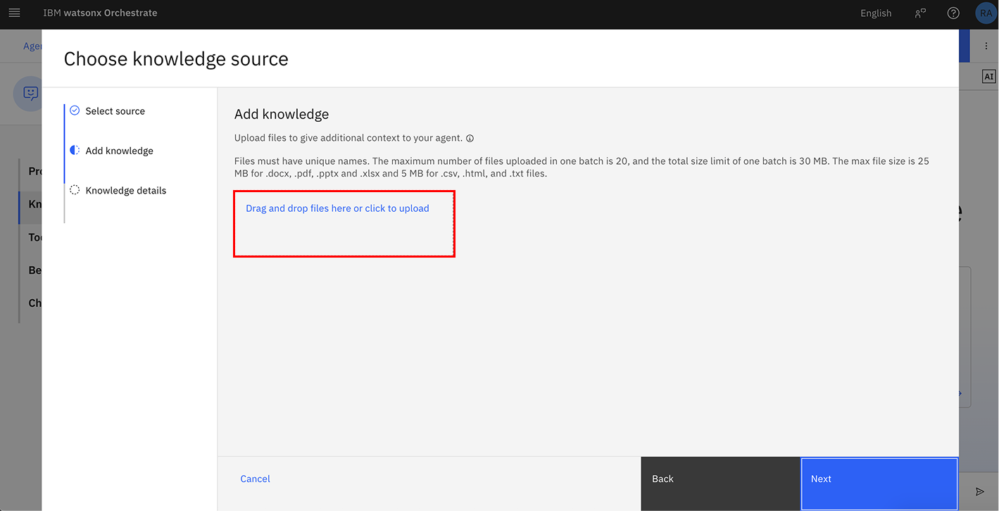

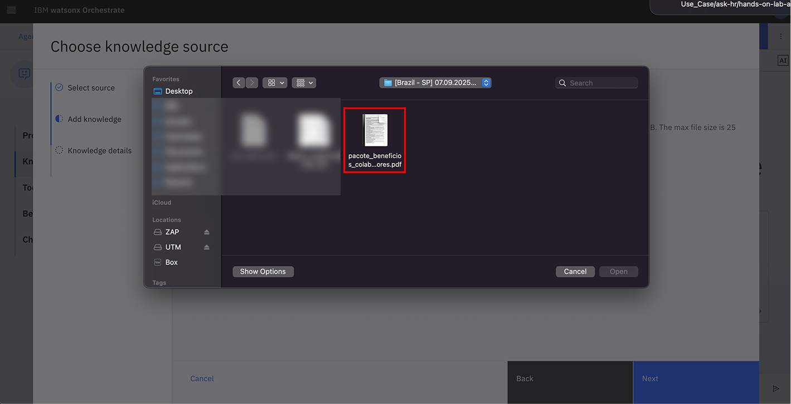

- Coloque o nome de `Beneficios Colaboradores`

- Copie a seguinte descrição na seção Descrição e clique em `Next`

<code> Este documento foi criado para ajudar você a responder dúvidas comuns sobre o pacote de benefícios oferecido pela empresa aos colaboradores. Use este documento como uma fonte de referência e conhecimento. Ele foi estruturado para facilitar o entendimento e garantir que todos os colaboradores tenham acesso às informações de forma clara e objetiva. </code> 

13. Clique em `Next`

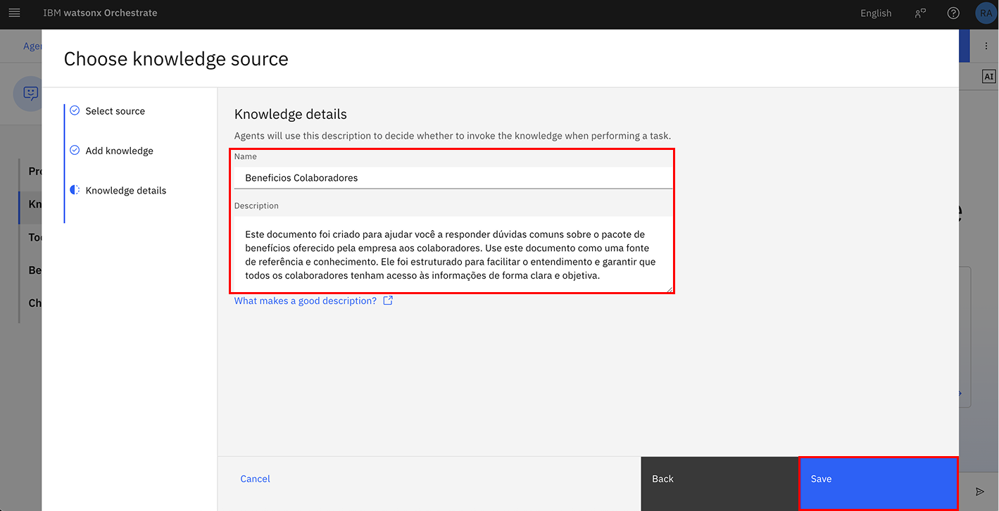

Aguarde alguns instantes enquanto esse documento fica disponível para uso para o Agente que está sendo desenvolvido.

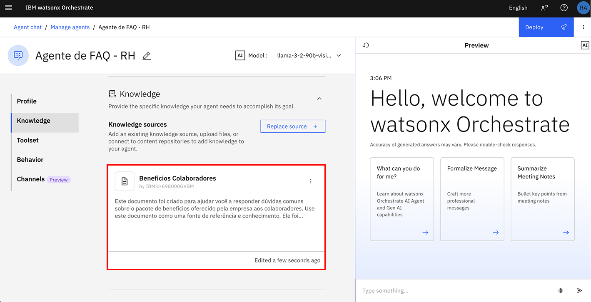

14. Role para baixo até a seção **Behavior**. Insira as instruções abaixo no campo **Instructions**:

```
Responda somente em Português do Brasil.
Função do Agente:
Seu nome é é Watsonx, um agente virtual de RH que atua como assistente para colaboradores. Seu papel é fornecer informações sobre benefícios, respondendo as dúvidas com empatia, cordialidade e fluidez. 

Comportamento esperado:

Apresente-se como Watson no início da conversa.
Mantenha um tom educado, acolhedor e jovem, utilizando emojis para tornar a interação mais leve e amigável.
Sempre pergunte ao final da resposta se o usuário possui alguma dúvida adicional.

Regras de atendimento:

## Consultas sobre benefícios:
Use a base de conhecimento **pacote_beneficios_colaboradores.pdf** para responder perguntas sobre benefícios.
As respostas devem ser naturais, empáticas e baseadas no conteúdo do documento.
```

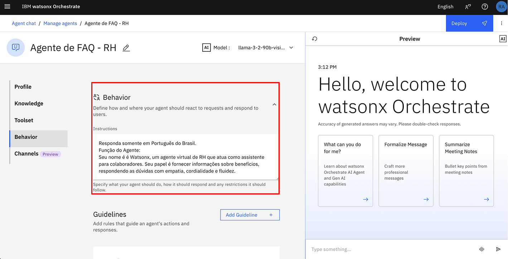

15. Navegue até a sessão `Channels`

16. Desabilite a opção em `Home pages`

> Importante: Esta opção mantém o agente desabilitado na página principal de interação, pois futuramente será implementado um agente orquestrador responsável por gerenciar e direcionar os usuários para os agentes apropriados, conforme o contexto da interação. Se preferir utilizar seu agente de forma individual e direta, você pode manter esta opção habilitada. Assim, ele ficará disponível para uso imediato, fora do fluxo orquestrado.

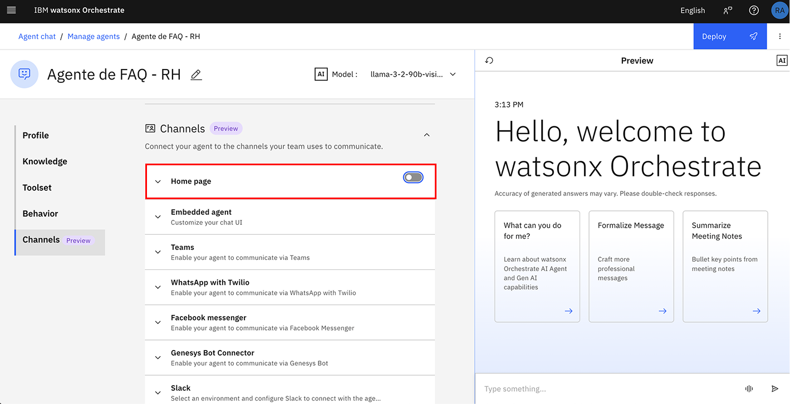

Agora, vamos testar o agente que constrúimos até aqui.

<b>Importante:</b> Esta opção mantém o agente desabilitado na página principal de interação, pois futuramente será implementado um agente orquestrador responsável por gerenciar e direcionar os usuários para os agentes apropriados, conforme o contexto da interação. Se preferir utilizar seu agente de forma individual e direta, você pode manter esta opção habilitada. Assim, ele ficará disponível para uso imediato, fora do fluxo orquestrado. chat de pré visualização à direita.

Utilize um exemplo como o da imagem abaixo:

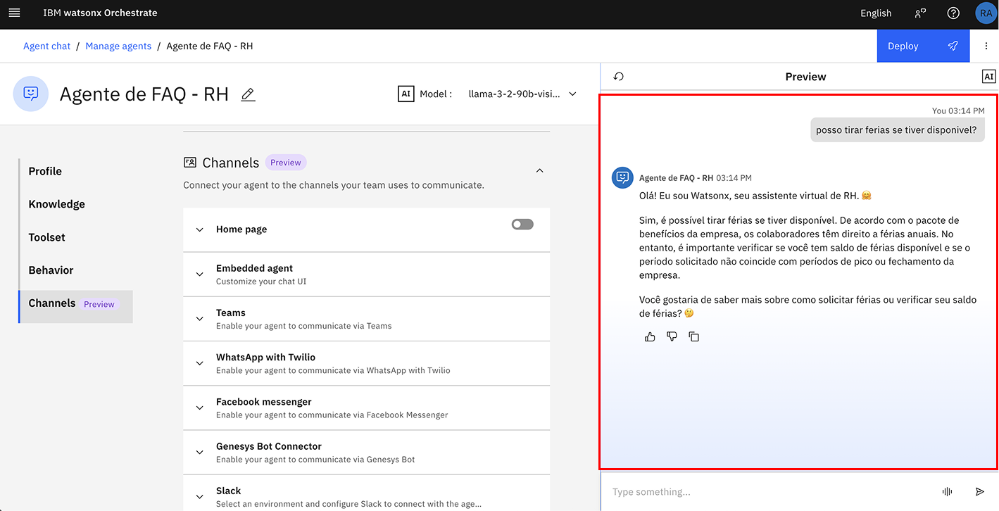

Aguarde alguns segundos enquanto o agente busca a resposta na fonte de conhecimento que construímos.

> Ao clicar em `Show reasoning` conseguimos ver como o agente chegou a resposta

> Ao clicar na seta V conseguimos visualizar qual fonte de conhecimento foi utilizada para responder a solicitação do usuário.

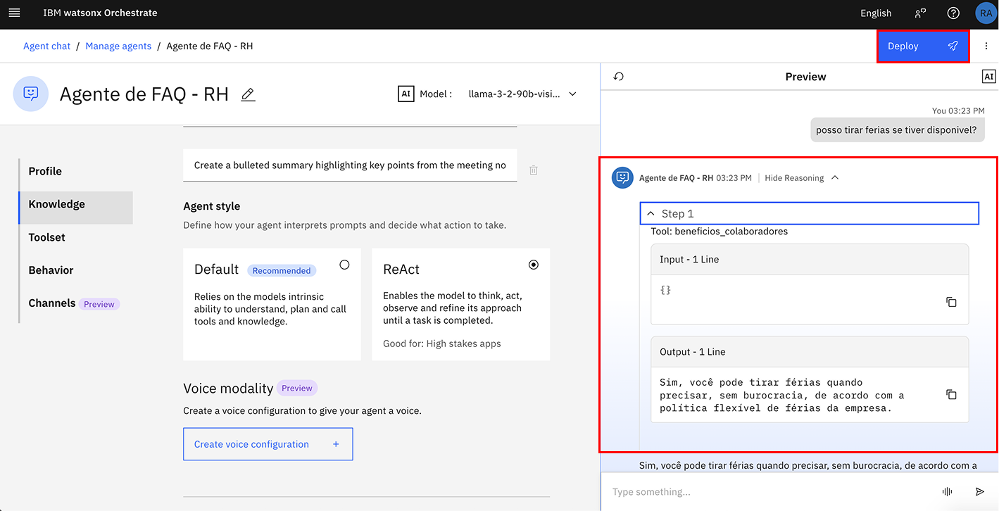

Você pode testar algumas das perguntas como o exemplo abaixo:

```
1. Quais são os benefícios para animais?
2. Quem é você?
3. O que a minha empresa me oferece?
```

Depois de validar as respostas, clique em **Deploy** no canto superior direito para fazer deploy de seu agente:

- Clique em `Deploy` novamente

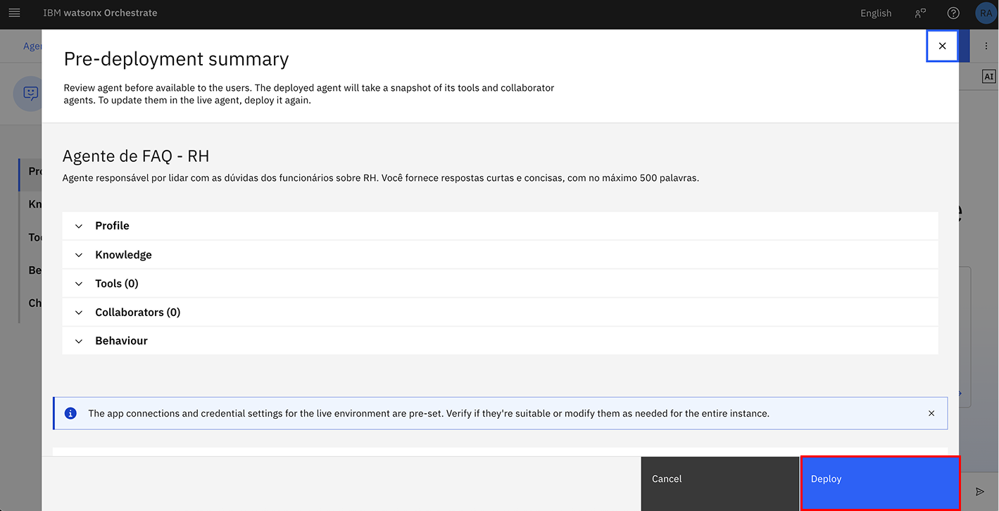

Aguarde alguns instantes até que o deploy de seu agente fique pronto...

Retorne para a página de agentes, navegando através do topo da tela (onde fica localizado o botáo Deploy) mas ao lado esquerdo da tela

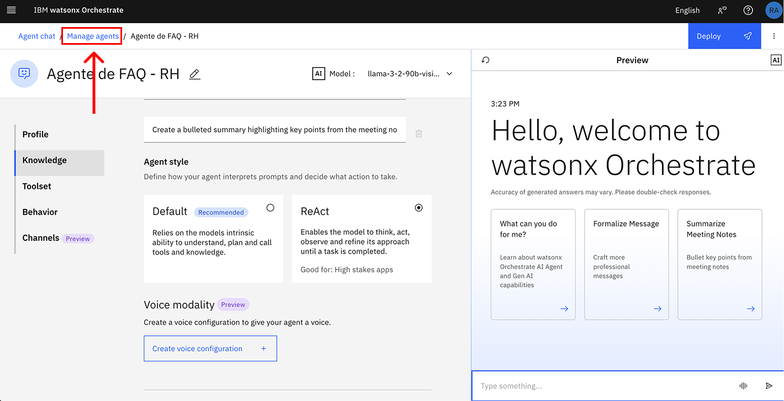

<b>Parabéns. Você criou o seu primeiro agente utilizando o Watsonx Orchestrate =) </b>

Vamos para o próximo? Clique [aqui](../Lab_02_Agente_Operacoes_RH/Lab02.md) para começar o Lab 02