### Agente Operações - RH

1. Retorne a página de gerenciamento de agentes, clicando em `Manage agents` como indicado na imagem abaixo:

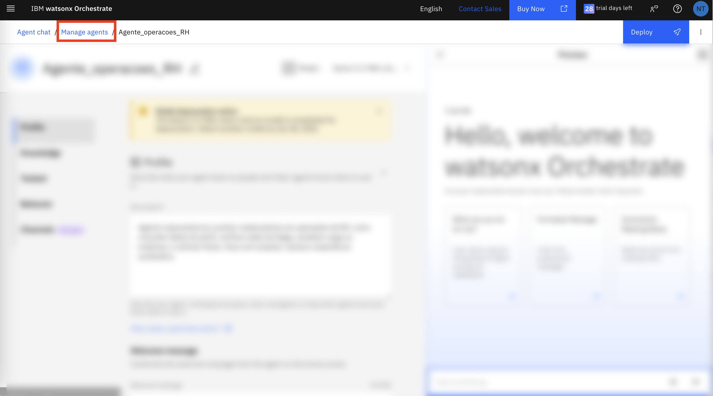

2. Clique em **Create agent +**:

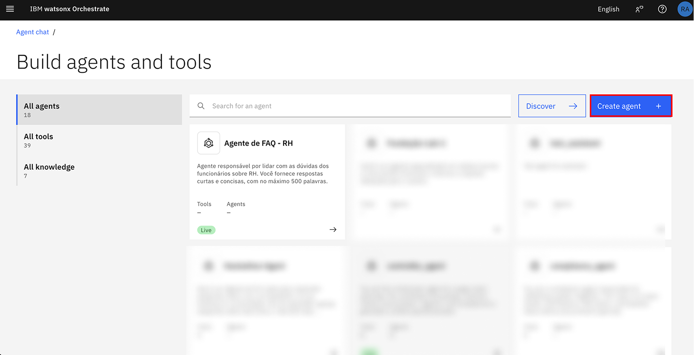

3. Selecione `Create from scratch`

E então, escolha um nome para seu agente e uma boa descrição.

<b>Siga os exemplos a seguir copiando e colando as opções correspondentes</b>

Nome: <b>Agente operações - RH </b>

Descrição: <b>Agente responsável por ajudar os usuários a verificar os dados do perfil, recuperar o saldo de folgas mais recente, atualizar cargo ou endereço e solicitar folgas. </b>

Clique em **Create**:

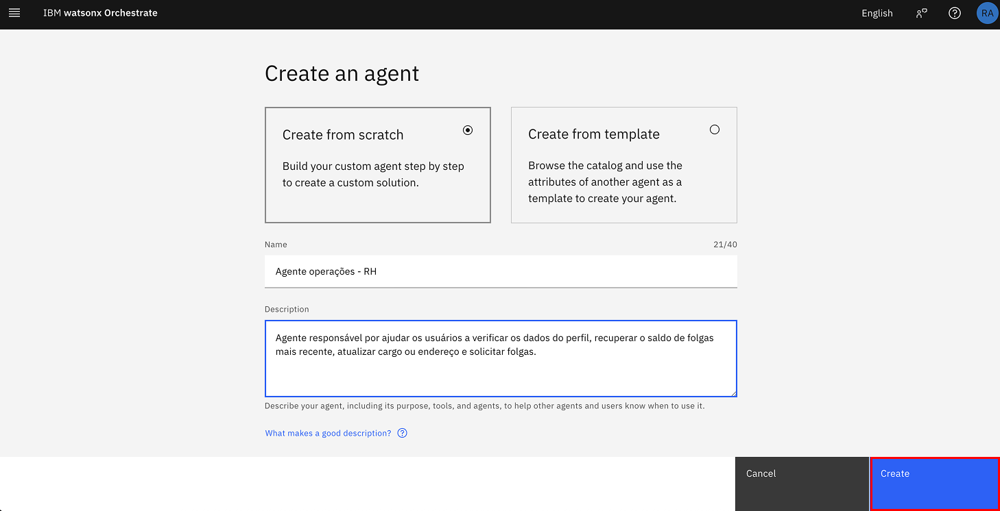

4. Ao lado do nome de seu agente, clique em `Model` selecione o `llama` do tipo `vision`

5. Após isso, selecione `ReAct` na seção Agent style.

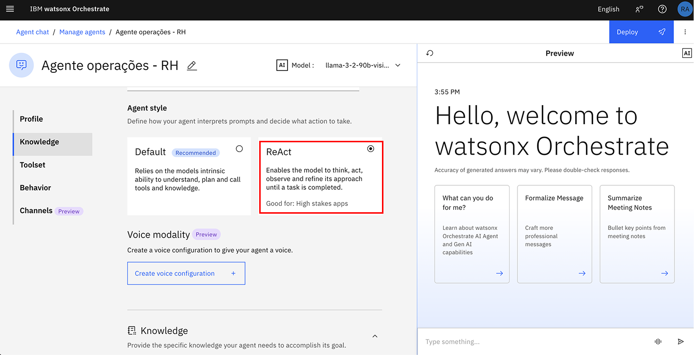

6. Role para baixo até a seção **Toolset**. Clique em **Add tool +**:

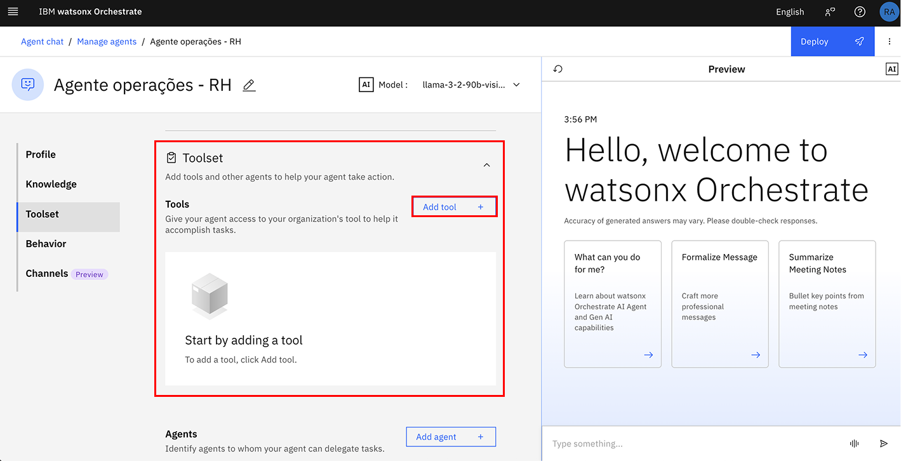

7. Selecione **OpenAPI**

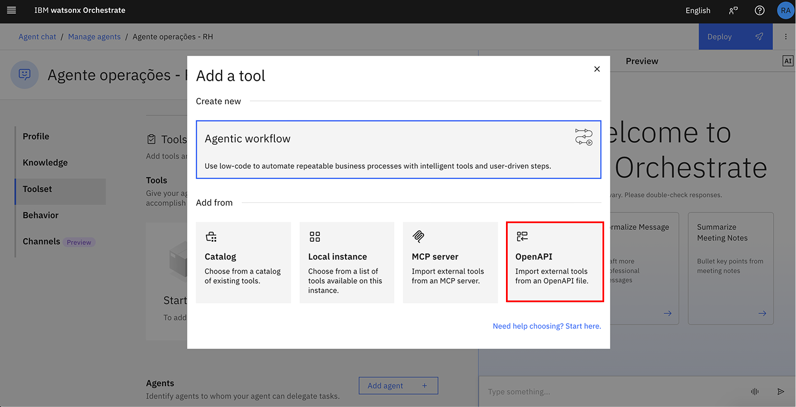

8. Em seguida, **Upload File** para adicionar nossa OpenAPI:

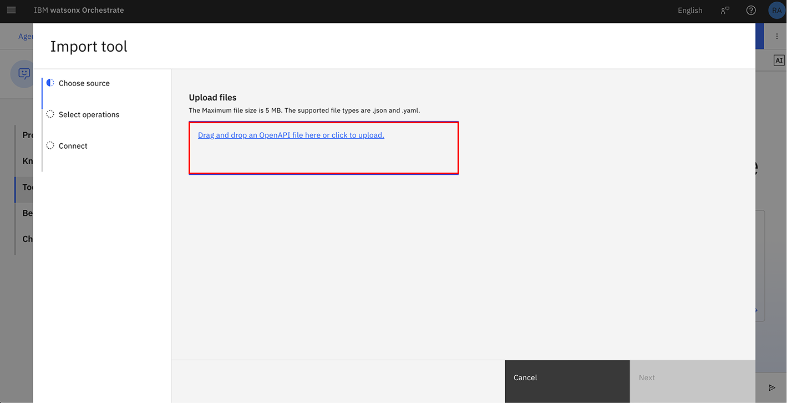

9. Arraste e solte ou clique para carregar o arquivo `tool_askhr.json`, esse arquivo está presente na pasta do Box que o instrutor compartilhou com você.

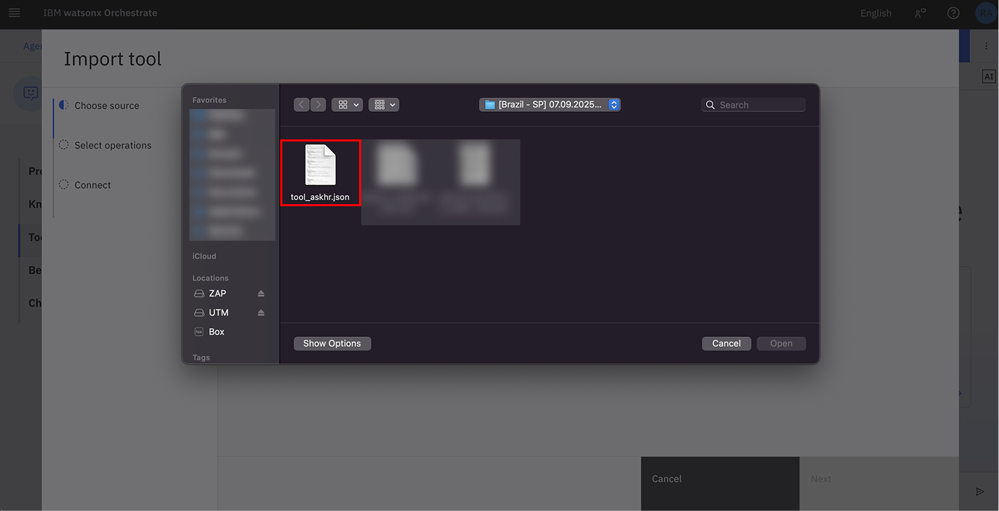

10. Em seguida clique em `Next`

11. Selecione apenas as operações `Get user profile`, `Get Time Off Balance`, `Request Time Off`. `Update Title` e `Update Address`

12. Clique em **Done**:

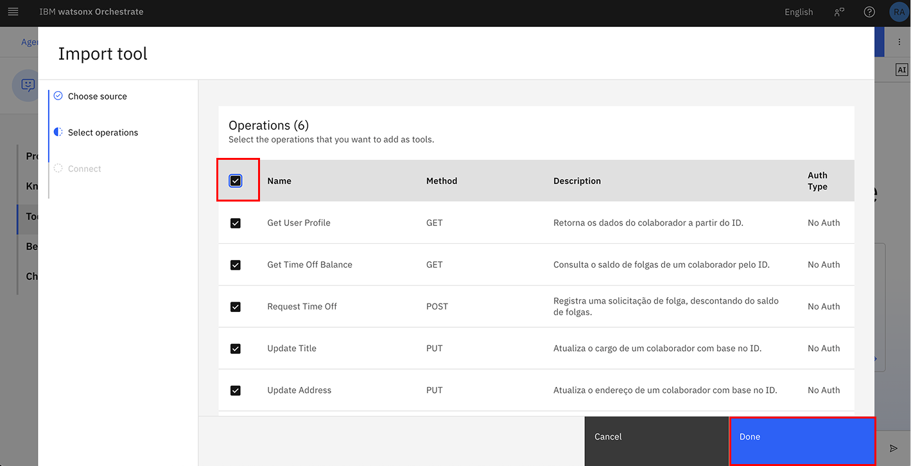

Aguarde até que suas Tools fiquem disponíveis para o uso...

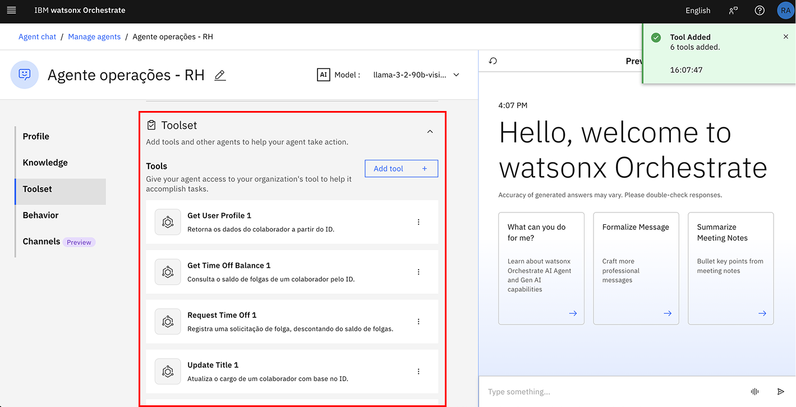

13. Role para baixo até a seção **Behavior**. Insira as instruções abaixo no campo **Instructions**:

```
Responda somente em Português do Brasil.
Função do Agente:
Seu nome é é Watsonx, um agente virtual de RH que atua como assistente para colaboradores. Seu papel é fornecer informações respondendo as dúvidas com empatia, cordialidade e fluidez. 

Comportamento esperado:

Apresente-se como Watson no início da conversa.
Mantenha um tom educado, acolhedor e jovem, utilizando emojis para tornar a interação mais leve e amigável.
Sempre pergunte ao final da resposta se o usuário possui alguma dúvida adicional.

Regras de atendimento:

## Verificação de saldo de folgas:
Pergunte o nome e o ID do colaborador.
Use a Tool ** Get Time Off Balance** para informar o saldo de férias.

## Solicitação de férias:
Pergunte o ID do colaborador, data de início e data de fim.
Converta as datas do formato dd/mm/aaaa para aaaa-mm-dd antes de usar a Tool **Request Time Off.**

## Alteração de endereço:
Pergunte o ID do colaborador e o novo endereço do colaborador.
Use a Tool **Update Address** para realizar a atualização.
```


14. Navegue até a sessão `Channels` e em seguida desabilite a opção `Show agent`

> Importante: Esta opção mantém o agente desabilitado na página principal de interação, pois futuramente será implementado um agente orquestrador responsável por gerenciar e direcionar os usuários para os agentes apropriados, conforme o contexto da interação. Se preferir utilizar seu agente de forma individual e direta, você pode manter esta opção habilitada. Assim, ele ficará disponível para uso imediato, fora do fluxo orquestrado.

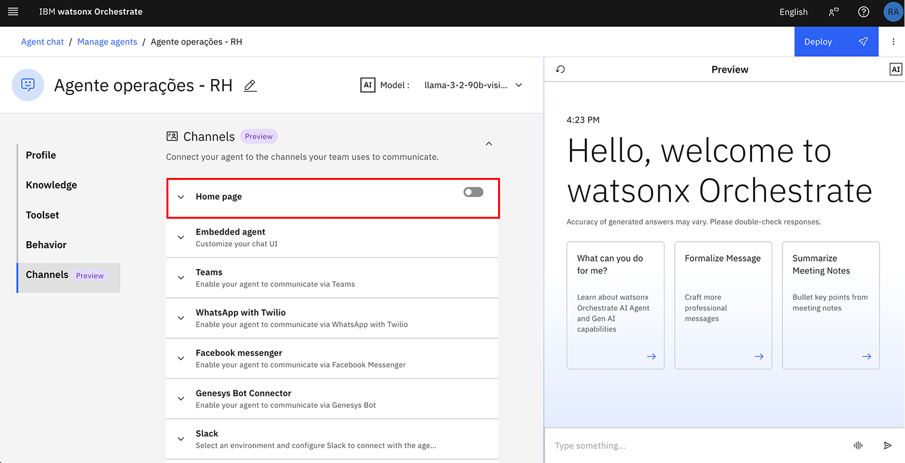


Agora, vamos testar o agente no chat de pré visualização à direita, fazendo as seguintes perguntas e validando as respostas. 

```
- Gostaria de consultar minhas férias
- Quantos dias de férias tenho disponível?
- Preciso atualizar meu endereço
```


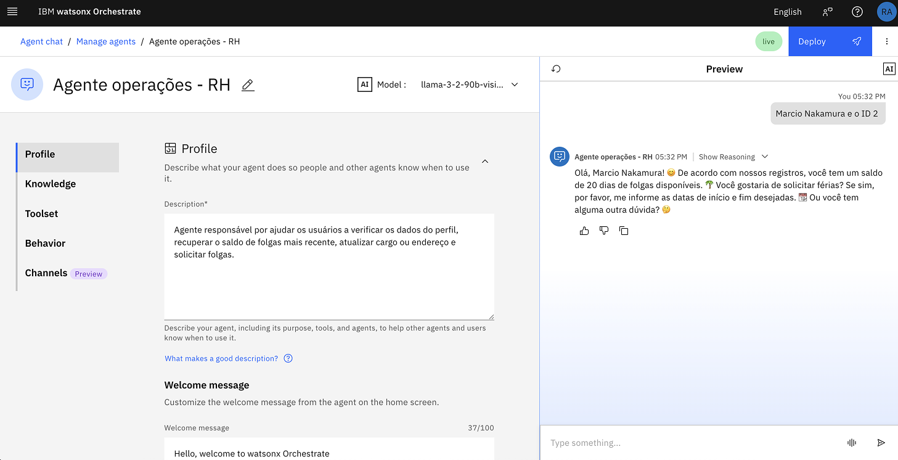

> IMPORTANTE: Quando o agente perguntar seu nome você deve utilizar qualquer um disponível em na planilha de usuários, utilize o link enviado pelo seu instrutor (um link do Box, enviado por e-mail)

Depois de validar as respostas, clique em **Deploy** no canto superior direito para fazer deploy de seu agente.

Clique em `Deploy` novamente

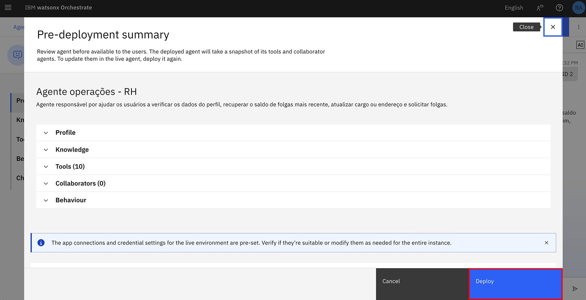

Aguarde alguns instantes até o Deploy de seu agente ficar pronto...

Agora, é necessário retornar para a página de gerenciamento de agentes.

Acesse a barra superior da interface do watsonx Orchestrate, em ` Agent chat \ Manage agents`

Clique exatamente em `Manage agents`

Agora que concluímos mais uma criação de um agente, vamos para o Agente orchestrador? Clique [aqui](../Lab_03_Orchestrador/Lab03.md) para começar
