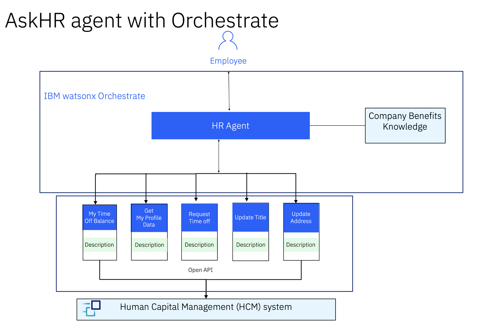

# Caso de Uso: Agente Único Orquestrador para Operações de RH na TechCorp

## Desafio

Após implementar agentes inteligentes para responder dúvidas básicas e integrar sistemas de RH para tarefas como alteração de endereço, verificação de férias e solicitação de férias, <b>a TechCorp ainda enfrenta um desafio: a experiência está fragmentada entre diferentes agentes especializados.</b> Os colaboradores precisam interagir com múltiplos pontos de acesso, o que reduz a fluidez e a eficiência.

### Solução Proposta

Vamos dar o passo final na jornada de automação da TechCorp: criar um agente único orquestrador, responsável por:

-> Centralizar todas as interações em um único ponto de contato.

-> Interpretar solicitações em linguagem natural e identificar qual agente especialista deve executar a tarefa.

-> Orquestrar as requisições para os agentes especializados (ex.: agente de FAQ, agente de RH para férias, agente para atualização de dados).

-> Consolidar as respostas e apresentar ao usuário de forma clara e contextualizada.

### Como Vai Funcionar

O colaborador interage com um único agente (ex.: “Preciso atualizar meu endereço e saber meu saldo de férias”).
O agente orquestrador:

-> Analisa a intenção e divide em subtarefas.

-> Direciona cada subtarefa para o agente especialista adequado.

-> Recebe as respostas e consolida tudo em uma única interação.

O usuário recebe uma resposta completa, sem precisar saber qual sistema ou agente está por trás.

### Benefícios para a TechCorp

-> Experiência unificada para o colaborador.

-> Redução de complexidade e curva de aprendizado.

-> Maior eficiência operacional e escalabilidade.

-> Flexibilidade para adicionar novos agentes no futuro sem impactar a experiência do usuário.

Com o agente orquestrador, a <b>TechCorp</b> alcança o nível máximo de automação inteligente, oferecendo uma experiência fluida e integrada, eliminando barreiras entre sistemas e garantindo agilidade e precisão em todas as operações de RH.

### Demonstração

Em construção...

## 👩‍💻👨‍💻 Laboratório prático passo a passo

👉👉👉 [Clique aqui](./Step_by_Step_Lab3.md) para executar as instruções passo a passo aqui e implemente este caso de uso agora mesmo.

