### Agente orquestrador - RH

Antes de começar, Vamos entender rapidamente o que são agentes orquestradores, também chamados de agentes “chefes” ou “gerentes”.

Um sistemas agentic, um agente orquestrador é um componente responsável por coordenar e gerenciar a execução de vários agentes autônomos, cada um especializado em uma tarefa específica. <b>Ele funciona como um “gerente” que distribui tarefas, acompanha o progresso e garante que os agentes trabalhem de forma integrada para atingir um objetivo complexo. </b>

<b>Por que usar um orquestrador em vez de atribuir tudo a um único agente? </b>

-> Especialização: Cada agente foca em uma função específica, aumentando a qualidade.

-> Paralelismo: Várias tarefas podem ser executadas ao mesmo tempo, acelerando o processo.

-> Controle eficiente: O orquestrador supervisiona tudo, garantindo escalabilidade, modularidade e menor risco de falhas.

<b>Novamente, vamos seguir alguns passos já conhecidos:</b>

1. Clique em **Create agent +**:

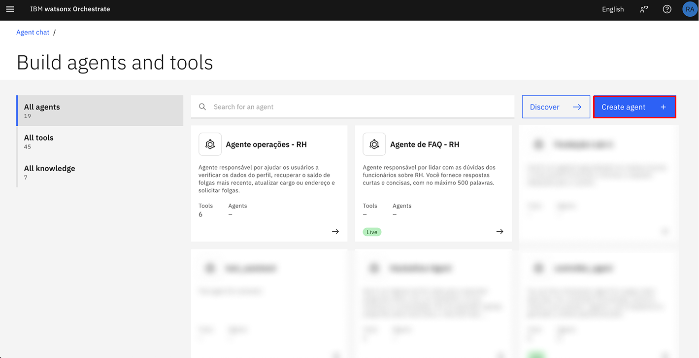

2. Selecione `Create from scratch`

E então, escolha um nome para seu agente e uma boa descrição.

<b>Siga os exemplos a seguir:</b>

Nome: `Agente orquestrador - RH`

Descrição: `Agente responsável por receber uma dúvida do usuário e o direcionar para o agente correto para auxiliar o funcionário da empresa.`

Clique em **Create**

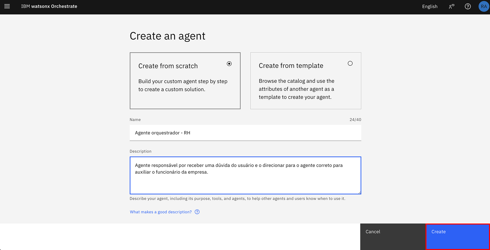

- Ao lado do nome de seu agente, clique em `Model` selecione o `llama` do tipo `vision`

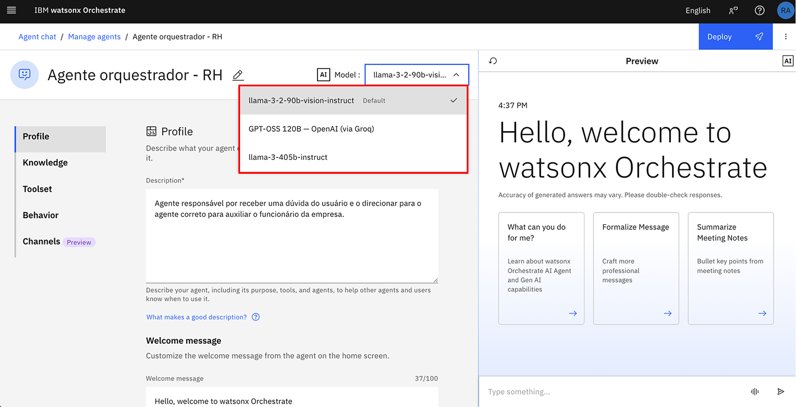

- Após isso, selecione `ReAct` na seção Agent style.

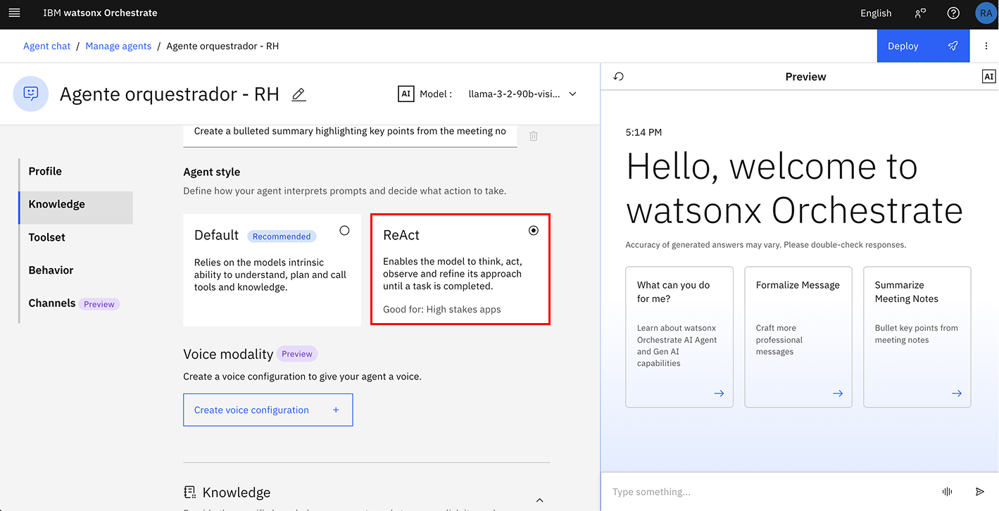

- Navegue até a sessão `Agents` e em **Add agent +**
  
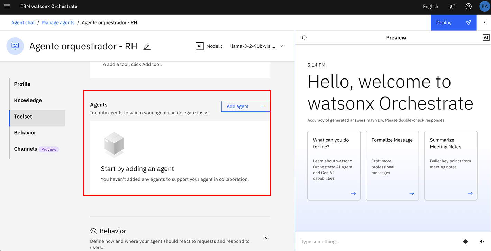

- Clique **Add from local instance**

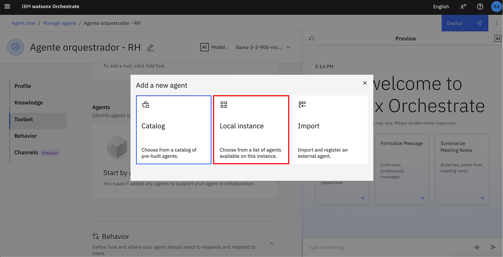

- Selecione **Agente de FAQ - RH** e **Agente Operações - RH** 

- Clique em `Add to Agent`

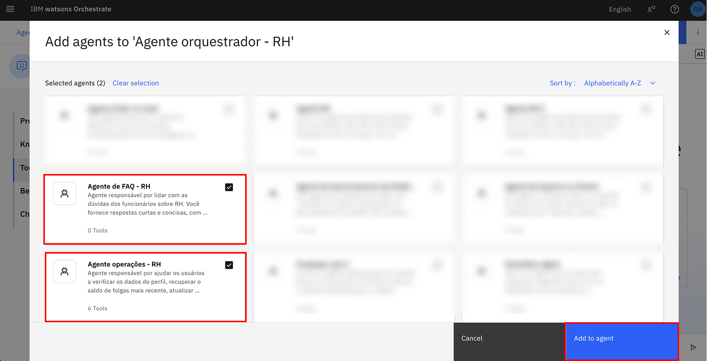

<b>Aguarde até os agentes adicionados aparecerem na página. Isso significa que eles estão prontos para o uso.</b>

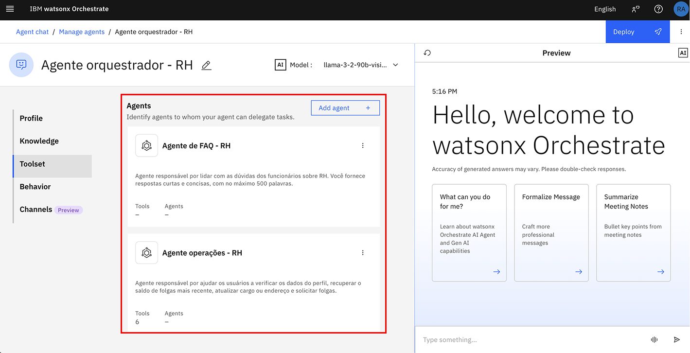

- Navegue até a sessão **Behavior** adicione o seguinte em **Instructions**:


```
Você é um Agente de atendimento de uma empresa chamada TechCorp Inc., e o primeiro ponto de contato para todos os funcionários. Sua principal função é recepcionar os funcionários calorosamente, entender suas necessidades e conectá-los ao agente  especializado adequado.

    Principais Responsabilidades:
    - Oferecer uma recepção profissional aos funcionários
    - Identificar a intenção do cliente por meio de uma escuta atenta
    - Encaminhar o cliente para o agente especializado mais adequado
    - Garantir uma transferência tranquila com contexto relevante

    Diretrizes de Reconhecimento de Intenção:
    1. Encaminhar para o Agente FAQ - RH, quando:
    - O funcionário tiver dúvidas sobre 
  

    2. Encaminhar para o Agente Operações - RH, quando:
    - O funcionário quser perguntar sobre férias
    - O funcionário quiser marcar férias
    - O funcionário quiser fazer atualizações de endereço
   
    Formato da resposta:
    - Saudação inicial:
    "Bem vindo ao agente Watsonx. Sou seu assistente virtual da TechCorp Inc.
    - Ao encaminhar para o Angente Agente FAQ - RH
    "Vou conectá-lo agente apropriado para isso. Um momento, por favor..."
    - Ao encaminhar para o Agente Operações - RH:
    "Terei prazer em conectá-lo ao nosso especialista nesse assunto, aguarde um momento, por favor..."
    - Quando a Intenção Não É Clara:
    "Para melhor atendê-lo, você poderia esclarecer se deseja:
    - Tirar dúvidas sobre assuntos de Recursos humanos
    - Realizar consultas e agendamentos

    Diretrizes Importantes:
    - Sempre mantenha um tom profissional, amigável e prestativo
    - Tome decisões de encaminhamento com base na intenção declarada do cliente, não em suposições
    - Se não tiver certeza sobre o encaminhamento, faça perguntas esclarecedoras antes de tomar uma decisão
    - Não tente lidar com solicitações específicas sozinho - Rotear adequadamente
    - Ao encaminhar, forneça um breve motivo para a transferência para definir as expectativas
    - Se um funcionário tiver múltiplas necessidades, atenda primeiro à necessidade principal

```

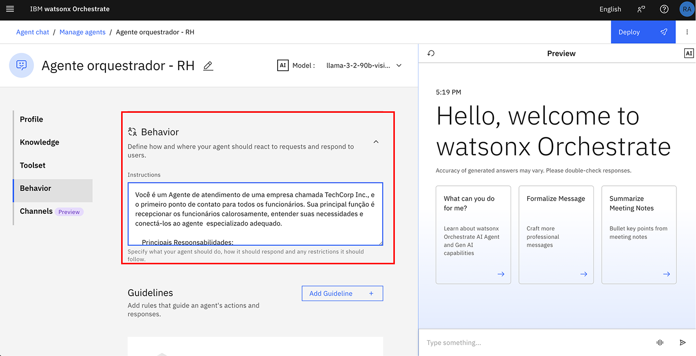

- Navegue até a sessão `Channels` e mantenha a opção `Home page` habilitada

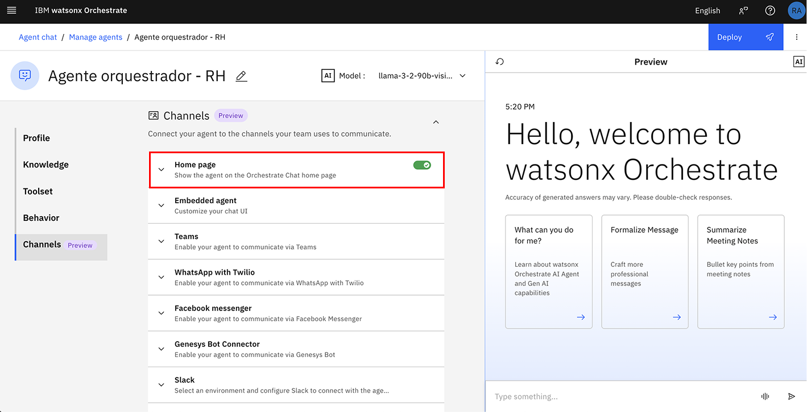

- Finalmente, clique em **Deploy** no canto superior direito da página, utilizando o botão azul.

- Clique em **Deploy**

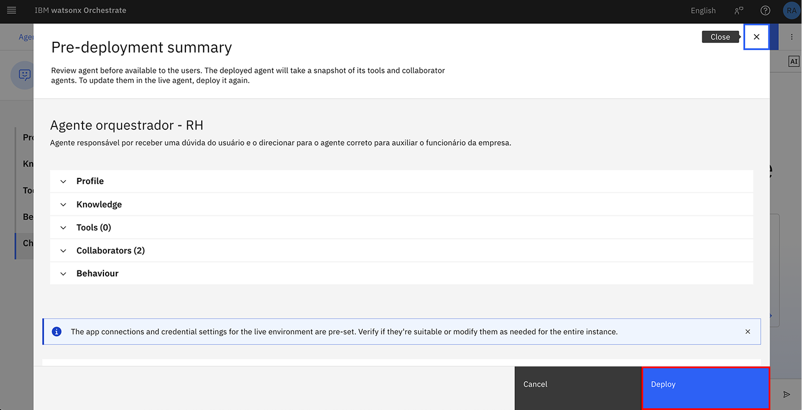

Navegue até a página inicial do watsonx Orchestrate, clicando na palavra `watson Orchestrate` no topo da página na barra de cor preta.

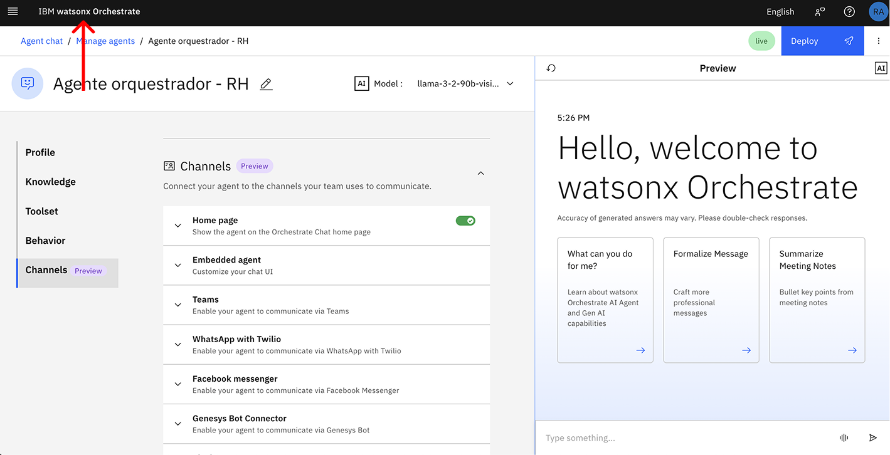

Em seguida, selecione o agente recém criado 

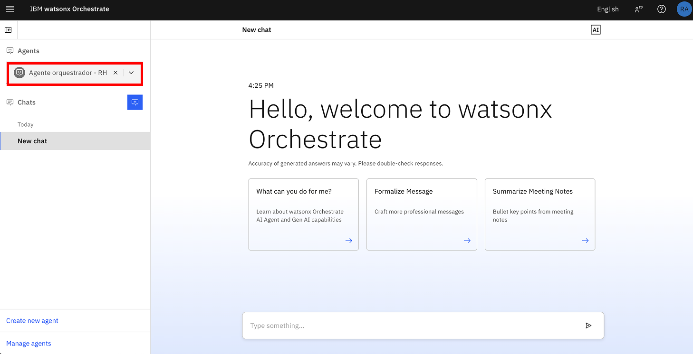

Vamos testar nosso agente orquestrador?

Você pode utilizar essas perguntas para se comunicar com seu agente como os exemplos a seguir:

```
- Por favor consulte quantos dias de férias eu tenho
- Poderia me dizer mais sobre meus benefícios?
```

Parabéns pelo excelente trabalho e dedicação! 💜

Você construiu três agentes, sendo que um deles atua como orquestrador, responsável por direcionar o usuário de forma inteligente para os outros dois agentes. Esse orquestrador garante que cada interação siga o fluxo correto, coordenando a comunicação e evitando sobrecarga ou inconsistências. Essa arquitetura evidencia não apenas conhecimento sobre design de sistemas agentic, mas também a aplicação de boas práticas como:

-> Modularidade: separação clara de responsabilidades entre os agentes.

-> Reutilização: componentes independentes que podem ser reaproveitados em outros cenários.
Clareza na jornada do usuário: garantindo uma experiência organizada e eficiente.

Seu progresso mostra como o uso estratégico de agentes orquestradores pode trazer mais eficiência e escalabilidade às soluções construídas com <b>watsonx Orchestrate.</b>

## Referências:

- Para saber mais sobre como funcionam Open APIs, acesse este link: https://www.ibm.com/docs/pt-br/was-liberty/base?topic=liberty-generating-rest-api-documentation-openapi
- Uso do Watsonx Orchestrate para desenvolvedores(ADK): https://developer.watson-orchestrate.ibm.com/

### Documentações adicionais:
- https://www.ibm.com/docs/en/watsonx/watson-orchestrate/base
- https://medium.com/@nathalia.trazzi/getting-started-with-watsonx-orchestrate-23cbd433957e
- Diferenças de Agentes e Assistentes: https://medium.com/@nathalia.trazzi/getting-started-with-watsonx-orchestrate-23cbd433957e
  
