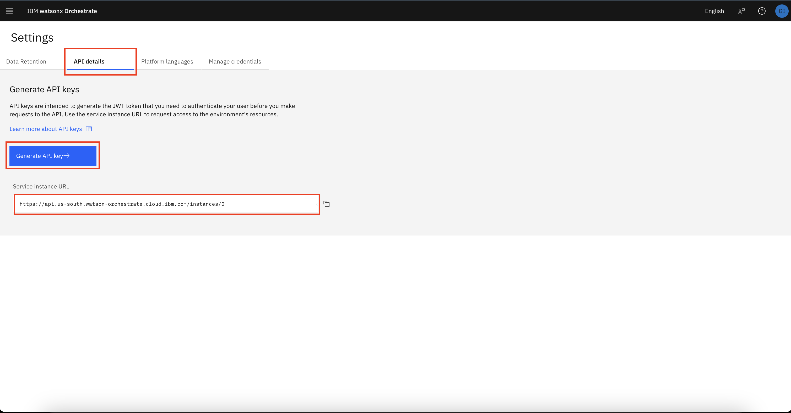
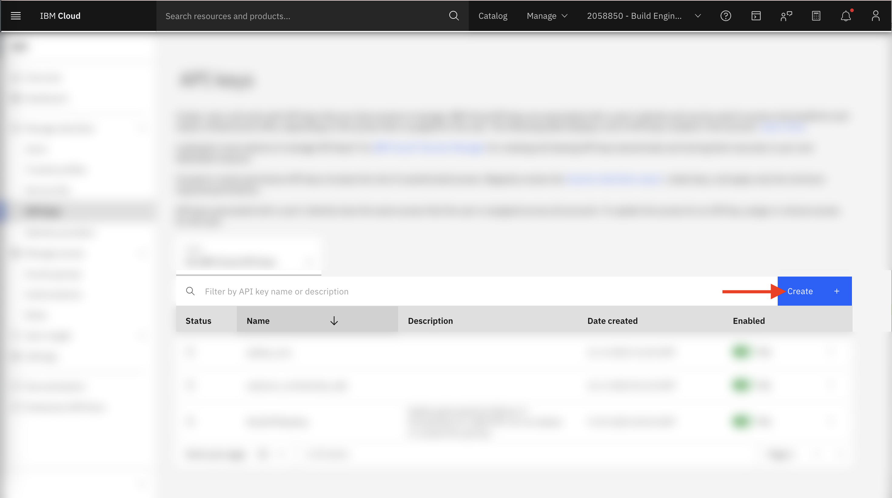
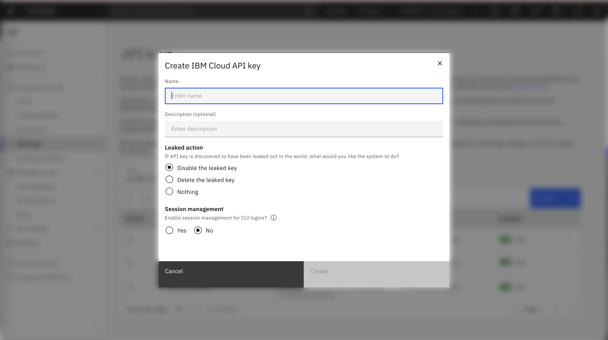
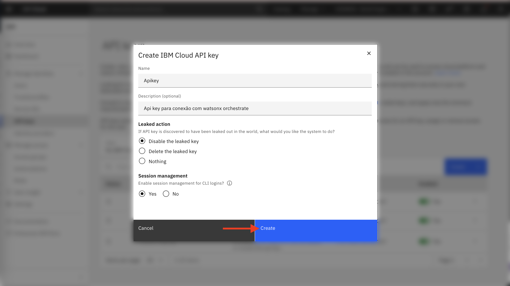
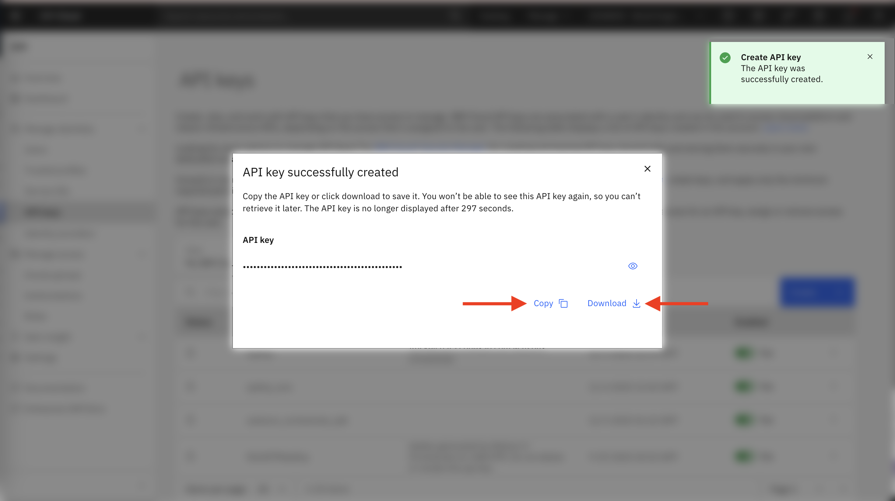

# AskHR: Automatize tarefas de RH com a IA da Agentic - ADK

## Índice
- [AskHR: Automatize tarefas de RH com a IA da Agentic - ADK](#askhr-automatize-tarefas-de-rh-com-a-ia-da-agentic---adk)
  - [Índice](#índice)
  - [Descrição do caso de uso](#descrição-do-caso-de-uso)
  - [Pré requisitos](#pré-requisitos)
  - [Iniciando com o watsonx Orchestrate](#iniciando-com-o-watsonx-orchestrate)
  - [Criando um ambiente e o ativando para o ADK](#criando-um-ambiente-e-o-ativando-para-o-adk)
  - [Agente FAQ - RH](#agente-faq---rh)
    - [Agente Operações - RH](#agente-operações---rh)
    - [Agente orquestrador - RH](#agente-orquestrador---rh)

## Descrição do caso de uso

Este caso de uso tem como objetivo desenvolver e realizar deploy de um agente AskHR utilizando o <b>Agent Development Kit (ADK)</b> para criação do agente, tool e knowledge. Esse agente permitirá que os colaboradores interajam com sistemas de Recursos Humanos de forma eficiente, por meio de uma interface utilizando Agentes.

Durante este laboratório, vamos construir um agente de RH no <b>Watsonx Orchestrate</b>, integrando ferramentas (Tools) e fontes de conhecimento externas para se conectar a um sistema simulado de Gestão de Capital Humano. O agente será capaz de recuperar informações relevantes de documentos para responder às dúvidas dos usuários, além de permitir que eles visualizem e gerenciem seus próprios perfis.
 
 ## Pré requisitos

- Certifique que você possui `Python 3.11` ou uma versão maior em seu sistema operacional.
  - Para checar sua versão de Python, abre seu terminal e rode:
    ```bash
    python --version
    ```
**Se você tiver uma versão antiga do Python, existem algumas opções para atualizá-la.**

<b>Windows</b>

    Faça o download em: https://www.python.org/downloads/windows/

<b>macOS</b>

No seu terminal, rode:

```bash
/bin/bash -c "$(curl -fsSL https://raw.githubusercontent.com/Homebrew/install/HEAD/install.sh)"
```

Então, execute:

```bash
brew install python@3.11
```

## Iniciando com o watsonx Orchestrate

Primeiro, instale o ADK em sua máquina:

```bash
pip install --upgrade ibm-watsonx-orchestrate
```

ou

```bash
pip3 install --upgrade ibm-watsonx-orchestrate
```

Para conectar na sua instância de **watsonx Orchestrate** na sua máquina, será necessário obter algumas credenciais.

Localize seu `Service Instance URL`

1. Abra sua instância de watsonx Orchestrate.
  
2. Navegue para **Settings** como mostrado na imagem abaixo:


3. Clique na aba `API Details` e copie o `Service Instance URL` 



4. Clique em `Generate API Key` você será encaminhado para outra página

5. Clique em `Create`



6. Agora, defina um nome para a chave e, se quiser, adicione uma descrição opcional.

-> Em seguida, escolha a ação que deve ocorrer caso a chave seja comprometida. Por questões de segurança, recomendamos sempre desabilitar ou excluir a chave para evitar riscos.

-> Por fim, na última configuração, você pode optar por habilitar o uso da chave via terminal, permitindo que ela seja utilizada em comandos diretamente na linha de comando.



7. Clique em `Create`



Certifique-se de salvar sua chave de API em um local seguro, pois você poderá não conseguir visualizá-la novamente mais tarde.



## Criando um ambiente e o ativando para o ADK


No seu terminal, execute o seguinte comando. Substitua `your_env_name` e `your_instance_number_url ` com o nome do ambiente escolhido e a URL que você copiou:

```bash
orchestrate env add -n your_env_name -u your_instance_number_url --type ibm_iam --activate
```

Você será solicitado a inserir sua chave de API:

```
Please enter WXO API key:
```


Ative o ambiente que você acabou de adicionar:

```bash
orchestrate env activate <environment_name>
```

## Agente FAQ - RH

Primeiramente, você precisará adicionar uma Base de Conhecimento ao watsonx Orchestrate

Para adicionar um `knowledge_base`, é necessário seguir alguns passos.

1. Crie um arquivo com nome de `knowledge_base_askHR.yaml`.
   
2. Após isso insira esse conteúdo no arquivo.
   ```yaml
   spec_version: v1
   kind: knowledge_base 
   name: knowledge_base_askHR
   description: |
        Este documento foi criado para ajudar você a responder dúvidas comuns sobre o pacote de benefícios oferecido pela empresa aos colaboradores. Use este documento como uma fonte de referência e conhecimento. Ele foi estruturado para facilitar o entendimento e garantir que todos os colaboradores tenham acesso às informações de forma clara e objetiva.
   documents:  
      - path: pacote_beneficios_colaboradores.pdf
   ```

3. Com o arquivo criado, execute esse comando em seu terminal:
   ```bash
   orchestrate knowledge-bases import -f knowledge_base_askHR.yaml
   ```

4. Lembre-se do nome `knowledge_base_askHR`, pois ele será utilizado em uma etapa posterior.

**Adicione Agentes**

Para criar e adicionar agentes para o seu caso de uso, você precisará criar um arquivo `.yaml` seguindo algumas configurações:

| Campo             | Descrição                                                                                     |
|-------------------|-------------------------------------------------------------------------------------------------|
| **spec_version**  | Versão do formato usado para definir o agente. `v1` = padrão atual do Orchestrate.             |
| **kind**          | Tipo do agente. `native` = agente interno do Orchestrate.                                      |
| **name**          | Nome exibido do agente. Usado para identificação no painel.                                    |
| **llm**           | Modelo de linguagem que o agente usa.                                                          |
| **style**         | Modo de raciocínio. `react` = pensa e age passo a passo.                                       |
| **description**   | Breve resumo do propósito do agente; ajuda na organização e entendimento do objetivo.          |
| **instructions**  | Parte onde você “ensina” o agente a atuar.                                                      |
| **tools**         | Ferramentas externas disponíveis. Vazio = o agente não usa ferramentas.                        |
| **collaborators** | Agentes adicionais que ele pode chamar. Vazio = funciona sozinho.                              |
| **knowledge_base**| Bases de conhecimento anexadas diretamente.                                                     |
| **restrictions**  | Define se o agente pode ser editado. `editable` = pode alterar no Orchestrate.                 |


Agora adicione esse conteúdo abaixo no seu arquivo `.yaml`.

```spec_version: v1
kind: native 
name: Agente_FAQ_RH
llm: watsonx/meta-llama/llama-3-2-90b-vision-instruct
style: react

description: Agente responsável por lidar com as dúvidas dos funcionários sobre RH. Você fornece respostas curtas e concisas, com no máximo 500 palavras. 

instructions: |
    Responda somente em Português do Brasil.
    Função do Agente:
    Seu nome é Watsonx, um agente virtual de RH que atua como assistente para colaboradores. Seu papel é fornecer informações sobre benefícios, respondendo as dúvidas com empatia, cordialidade e fluidez. 

    Comportamento esperado:

    Apresente-se como Watsonx no início da conversa.
    Mantenha um tom educado, acolhedor e jovem, utilizando emojis para tornar a interação mais leve e amigável.
    Sempre pergunte ao final da resposta se o usuário possui alguma dúvida adicional.

    Regras de atendimento:

    ## Consultas sobre benefícios:
    Use a base de conhecimento **pacote_beneficios_colaboradores.pdf** para responder perguntas sobre benefícios.
    As respostas devem ser naturais, empáticas e baseadas no conteúdo do documento.

tools:

collaborators: []
knowledge_base: [knowledge_base_askHR] 
restrictions: editable
```

Após isso, adicione esse comando para adicionar o agente no **watsonx Orchestrate**

<b>Lembre-se de usar o nome do seu arquivo criado no comando abaixo.</b>

```bash
orchestrate agents import -f nome_de_seu_arquivo.yaml
```

<b>Parabéns. Você criou o seu primeiro agente utilizando o Watsonx Orchestrate =) </b>

Vamos para o próximo? 

### Agente Operações - RH

Agora que você criou seu primeiro agente, vamos avançar para o próximo componente do laboratório:
**o Agente de Operações – RH.**

Este agente será responsável por consultar e atualizar dados dos colaboradores, integrando as ferramentas simuladas do sistema de RH.

Agora, vamos criar as tools no ambiente do **watsonx Orchestrate** com esse comando:

```bash
orchestrate tools import \
  -k python \
  -f tools.py \
  -r requirements.txt
```

Finalmente, vamos criar nosso agente que irá utilizar todas essas tools que acabamos de implementar.

Crie um arquivo `.yaml` com um nome de sua escolha e adicione esse conteúdo no arquivo:

```yaml
spec_version: v1
kind: native 
name: Agente_operacoes_RH
llm: watsonx/meta-llama/llama-3-2-90b-vision-instruct
style: react

description: Agente responsável por ajudar os usuários a verificar os dados do perfil, recuperar o saldo de folgas mais recente, atualizar cargo ou endereço e solicitar folgas.

instructions: |
    Responda somente em Português do Brasil.
    Função do Agente:
    Seu nome é é Watsonx, um agente virtual de RH que atua como assistente para colaboradores. Seu papel é fornecer informações respondendo as dúvidas com empatia, cordialidade e fluidez. 

    Comportamento esperado:

    Apresente-se como Watson no início da conversa.
    Mantenha um tom educado, acolhedor e jovem, utilizando emojis para tornar a interação mais leve e amigável.
    Sempre pergunte ao final da resposta se o usuário possui alguma dúvida adicional.

    Peça e colete os parâmetros necessários para as Tools

    Regras de atendimento:

    ## Listar todos os colaboradores:
    Liste todos os colaborador.
    Use a Tool **list_employees** para informar a lista de colaborador.

    ## Obter informações sobre o colaborador:
    Liste todos os nomes dos colaboradores usando a Tool **get_employee**.

    ## Procurar um colaborador:
    Pergunte o ID do colaborador.
    Liste o nome do colaborador usando a Tool **search_employee**

    ## Atualizar as férias do colaborador:
    Pergunte o ID do colaborador e o nome.
    Mostre para o colaborador suas férias e faça a atualização utilizando a Tool **update_employee_vacation**

    ## Atualizar o endereço do colaborador:
    Pergunte o ID do colaborador e o novo endereço do colaborador.
    Use a Tool **update_employee_address** para realizar a atualização.


tools: 
    - list_employees
    - get_employee
    - search_employee
    - update_employee_vacation
    - update_employee_address
    - add_employee
    - remove_employee

collaborators: []
knowledge_base: [] 
restrictions: editable
```

Após isso, adicione esse comando para adicionar o agente no **watsonx Orchestrate**

```bash
orchestrate agents import -f nome_de_seu_arquivo.yaml
```

Agora, Teste seu agente no chat de pré visualização diretamente na interface do watsonx Orchestrate, fazendo as seguintes perguntas e validando as respostas.
```
- Gostaria de consultar minhas férias
- Quantos dias de férias tenho disponível?
- Preciso atualizar meu endereço
```

Agora que concluímos mais uma criação de um agente, vamos para o agente final?

### Agente orquestrador - RH

Crie um novo arquivo `.yaml`, contendo esse conteúdo abaixo:

```yaml
spec_version: v1
kind: native 
name: Agente_Orquestrador_RH
llm: watsonx/meta-llama/llama-3-2-90b-vision-instruct
style: react

description: Agente responsável por receber uma dúvida do usuário e o direcionar para o agente correto para auxiliar o funcionário da empresa.

instructions: |
    Diretrizes de Reconhecimento de Intenção:

    1. Encaminhar para o Agente_FAQ_RH quando:
    - O funcionário tiver dúvidas gerais sobre RH
    - O funcionário fizer perguntas informativas sobre férias sem solicitar uma ação
      Exemplos:
      - "Posso tirar férias?"
      - "Como funciona o processo de férias?"
      - "Se eu tiver saldo, posso tirar dias de folga?"
      - "Como é calculado o saldo de férias?"
    - O funcionário quiser apenas entender regras, direitos, políticas ou orientações

    2. Encaminhar para o Agente_operacoes_RH quando:
    - O funcionário pedir para realizar uma ação relacionada a férias:
      - "Quero solicitar férias"
      - "Quero marcar férias"
      - "Agende minhas férias"
      - "Registre férias do dia X ao dia Y"
    - O funcionário pedir atualizações cadastrais:
      - Atualizar endereço
      - Atualizar cargo
    - O funcionário pedir consultas operacionais:
      - "Consultar meu saldo de férias"
      - "Quantos dias eu ainda tenho para marcar?"

    Quando a intenção não for clara:
    - Pergunte:
      "Para melhor atendê-lo, você deseja apenas tirar dúvidas ou deseja solicitar/realizar alguma ação?"

tools: 

collaborators: [Agente_operacoes_RH, Agente_FAQ_RH] # Adicione os dois agentes que criamos anteriormente
knowledge_base: [] 
restrictions: editable
```

Por fim, rode o seguinte comando para adicionar o último agente, o Agente Orquestrador:

```bash
orchestrate agents import -f nome_de_seu_arquivo.yaml
```

Parabéns! O último agente foi adicionado com sucesso.

Agora você pode acessar o painel do **watsonx Orchestrate** e testar o fluxo completo do AskHR.
Experimente iniciar conversas com diferentes tipos de solicitações e observe como o Agente Orquestrador distribui as tarefas entre os agentes de FAQ e Operações.

Essa validação prática confirma que tudo está funcionando conforme esperado e ajuda a identificar oportunidades de melhoria. Seu progresso demonstra como a aplicação estratégica de agentes orquestradores aumenta a eficiência, escalabilidade e qualidade das soluções construídas com watsonx Orchestrate. Excelente trabalho! =)
